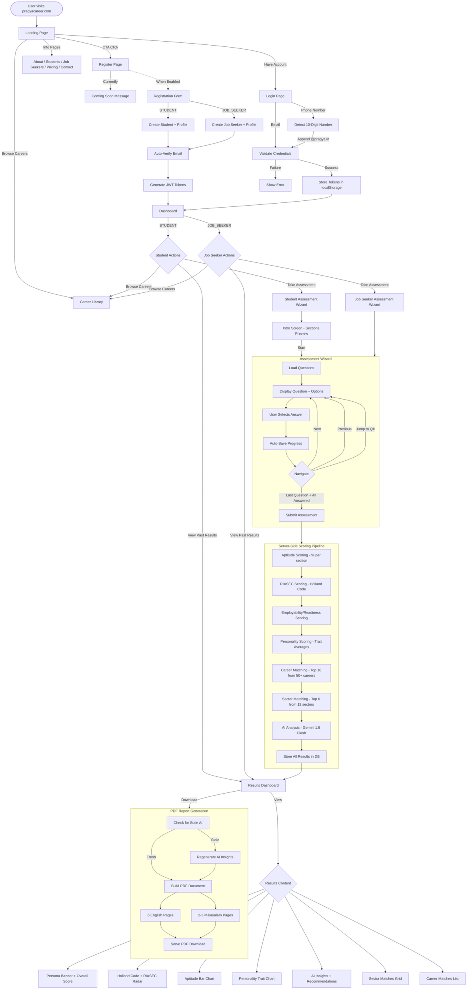
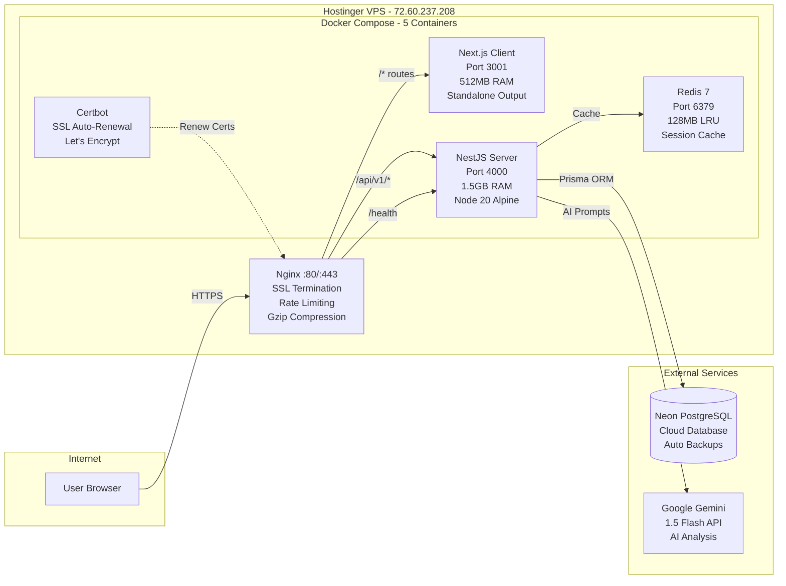

# Pragya — Complete Functionality Audit

**Platform**: Pragya Career Assessment Platform
**Live URL**: https://pragyacareer.com
**Tech Stack**: Next.js 16 (React 19) + NestJS 10 + PostgreSQL (Neon) + Redis + Docker
**VPS**: Hostinger KVM 1 (72.60.237.208), Ubuntu 24.04, 4GB RAM

---

## 1. User Roles

| Role | Status | Access |
|------|--------|--------|
| **STUDENT** | Active | Dashboard, Student Assessment, Results, Career Library, PDF Download |
| **JOB_SEEKER** | Active | Dashboard, Employability Assessment, Results, Career Library, PDF Download |
| **EMPLOYER** | Hidden (backend exists) | Employer Portal — not linked in UI, pending Razorpay |
| **ADMIN** | Backend only | User listing, toggle user status (no admin UI) |

---

## 2. All Pages

### Public Pages (No Auth Required)

| Route | File | Description |
|-------|------|-------------|
| `/` | `app/page.tsx` | Landing page — Hero carousel, Services, CompanyLogos, Testimonials, FAQ, CTASection |
| `/about` | `app/about/page.tsx` | About Pragya — mission, unique features, team info |
| `/career-library` | `app/career-library/page.tsx` | Career library — search bar (non-functional), stats grid, 12 category chips, CTA |
| `/career` | `app/career/page.tsx` | Career informational page |
| `/job-seekers` | `app/job-seekers/page.tsx` | Job seeker feature overview |
| `/students` | `app/students/page.tsx` | Student feature overview |
| `/contact` | `app/contact/page.tsx` | Contact page |
| `/pricing` | `app/pricing/page.tsx` | 2 plans (Career ₹1,499, Employability ₹1,499), 5-step payment flow, FAQs |
| `/login` | `app/login/page.tsx` | Login — email or phone number (auto-detects 10-digit Indian numbers) |
| `/register` | `app/register/page.tsx` | **Currently shows "Coming Soon"** — registration closed |
| `/verify-email` | `app/verify-email/page.tsx` | 6-digit OTP verification (flow disabled, page exists) |
| `/privacy-policy` | `app/privacy-policy/page.tsx` | Privacy policy |
| `/terms` | `app/terms/page.tsx` | Terms of service |
| `/refund-policy` | `app/refund-policy/page.tsx` | Refund policy |

### Authenticated Pages

| Route | File | Description |
|-------|------|-------------|
| `/dashboard` | `app/dashboard/page.tsx` | Role-based dashboard — profile card, quick actions, completed assessments |
| `/assessment` | `app/assessment/page.tsx` | Job seeker assessment wizard — multi-module, timer, auto-save, module stepper |
| `/students/assessment` | `app/students/assessment/page.tsx` | Student assessment wizard — 6 aptitude sections, intro screen, no timer |
| `/assessment/results/[id]` | `app/assessment/results/[id]/page.tsx` | Results dashboard — charts, RIASEC radar, AI insights, sector matches, PDF download |
| `/employer-portal` | `app/employer-portal/page.tsx` | Employer portal (hidden from navigation) |

### Layout & Providers

| File | Description |
|------|-------------|
| `app/layout.tsx` | Root layout — Nunito + Noto Sans Malayalam + Samarkan fonts, Navbar, Footer, AuthProvider |
| `app/providers.tsx` | Wraps app with AuthProvider |

---

## 3. All Frontend Components

| Component | File | Description |
|-----------|------|-------------|
| **Navbar** | `components/Navbar.tsx` | Sticky nav — Samarkan logo, desktop links, auth buttons, phone CTA (+91 95621 47770), social links, mobile menu. Employer links hidden. |
| **Footer** | `components/Footer.tsx` | Company info, links, copyright, social links. Employer links hidden. |
| **Hero** | `components/Hero.tsx` | 3-slide carousel (auto-play 5s), title/subtitle/CTA per slide, navigation dots |
| **Services** | `components/Services.tsx` | Grid of service cards (Career Assessment, RIASEC, AI Insights, Sector Matching) |
| **CTASection** | `components/CTASection.tsx` | Call-to-action routing to `/register` |
| **Stats** | `components/Stats.tsx` | Statistics banner |
| **FAQ** | `components/FAQ.tsx` | Expandable Q&A pairs |
| **Testimonials** | `components/Testimonials.tsx` | User testimonial cards |
| **CompanyLogos** | `components/CompanyLogos.tsx` | Partner/brand logo display |
| **TargetAudience** | `components/TargetAudience.tsx` | Segment-specific feature highlights |

---

## 4. Auth Context & API Client

### AuthContext (`context/AuthContext.tsx`)

| Function | Description |
|----------|-------------|
| `login(email, password)` | Authenticates user, stores tokens in localStorage |
| `register(data)` | Registers new user (currently disabled) |
| `logout()` | Clears tokens and state |
| `refreshUser()` | Fetches fresh user data from `/auth/me` |
| `user` | Current user object (null if logged out) |
| `isAuthenticated` | Boolean — `!!user` |
| `isLoading` | Auth state loading indicator |

### API Client (`lib/api.ts`)

- Axios instance, base URL: `NEXT_PUBLIC_API_URL` or `http://localhost:4000/api/v1`
- **Request interceptor**: Attaches `Authorization: Bearer {token}` from localStorage
- **Response interceptor**: On 401 → attempts token refresh → retries request → clears tokens on failure

---

## 5. All API Endpoints

### Auth (`/api/v1/auth/`)

| Method | Endpoint | Auth | Rate Limit | Status | Description |
|--------|----------|------|------------|--------|-------------|
| POST | `/register` | None | 5/min | **DISABLED** (403) | User registration |
| POST | `/login` | None | 5/min | Active | Email/password login |
| POST | `/refresh` | None | Default | Active | Refresh JWT tokens |
| POST | `/logout` | JWT | Default | Active | Invalidate refresh tokens |
| POST | `/verify-email` | None | 5/10min | Bypassed | OTP email verification |
| POST | `/resend-verification` | None | 5/10min | Bypassed | Resend OTP code |
| GET | `/me` | JWT | Default | Active | Get current user + profiles |

### Assessments (`/api/v1/assessments/`)

| Method | Endpoint | Auth | Roles | Description |
|--------|----------|------|-------|-------------|
| GET | `/` | JWT+Roles | STUDENT, JOB_SEEKER | List available assessments with user status |
| GET | `/:id/questions` | JWT+Roles | STUDENT, JOB_SEEKER | Get questions (no correct answers exposed) |
| POST | `/start` | JWT+Roles | STUDENT, JOB_SEEKER | Start assessment attempt, captures IP/UA |
| POST | `/save-progress` | JWT+Roles | STUDENT, JOB_SEEKER | Auto-save single answer + question index |
| POST | `/submit` | JWT+Roles | STUDENT, JOB_SEEKER | Submit all answers, trigger scoring + AI |
| GET | `/results/:id` | JWT | Owner only | Get specific assessment result |
| GET | `/my-results` | JWT | Any | Get all user's assessment results |

### Reports (`/api/v1/reports/`)

| Method | Endpoint | Auth | Roles | Description |
|--------|----------|------|-------|-------------|
| GET | `/:id/download` | JWT+Roles | STUDENT, JOB_SEEKER | Download bilingual PDF report |
| GET | `/:id/generate` | JWT+Roles | STUDENT, JOB_SEEKER | Regenerate PDF report |

### Users (`/api/v1/users/`)

| Method | Endpoint | Auth | Roles | Description |
|--------|----------|------|-------|-------------|
| GET | `/profile` | JWT | Any | Get user profile + role-specific profile |
| PATCH | `/profile/student` | JWT+Roles | STUDENT | Update student profile |
| PATCH | `/profile/job-seeker` | JWT+Roles | JOB_SEEKER | Update job-seeker profile |
| PATCH | `/profile/employer` | JWT+Roles | EMPLOYER | Update employer profile |
| GET | `/admin/list` | JWT+Roles | ADMIN | List all users (paginated) |
| PATCH | `/admin/:userId/toggle-status` | JWT+Roles | ADMIN | Activate/deactivate user |

### Health

| Method | Endpoint | Auth | Description |
|--------|----------|------|-------------|
| GET | `/health` | None | `{ status: "ok", timestamp }` |

---

## 6. Backend Services

| # | Service | File | Key Methods |
|---|---------|------|-------------|
| 1 | **AuthService** | `auth/auth.service.ts` | `register()`, `login()`, `refreshToken()`, `logout()`, `verifyEmail()`, `resendVerification()`, `getMe()`, `sanitizeUser()` — JWT generation (access 15m + refresh 7d), bcrypt 12 rounds, fullName hoisting |
| 2 | **AssessmentsService** | `assessments/assessments.service.ts` | `getAvailableAssessments()`, `getAssessmentQuestions()`, `startAssessment()`, `saveProgress()`, `submitAssessment()`, `processStudentAssessment()`, `processJobSeekerAssessment()` — orchestrates entire assessment pipeline |
| 3 | **ScoringService** | `assessments/scoring.service.ts` | `calculateAllScores()` (job seeker), `calculateStudentScores()` — 4-module scoring: Aptitude (% per section), RIASEC (Holland Code), Employability (weighted %), Personality (trait averages), Clarity Index (RIASEC focus + dominance) |
| 4 | **CareersService** | `assessments/careers.service.ts` | `findMatchingCareers()` — matches 50+ careers by RIASEC codes + aptitude thresholds, returns top 10 |
| 5 | **SectorMatchingService** | `assessments/sector-matching.service.ts` | `findMatchingSectors()` — cosine similarity (35%) + aptitude fit (30%) + personality fit (20%) + employability fit (15%), 12 sectors, readiness levels |
| 6 | **AiAnalysisService** | `ai-analysis/ai-analysis.service.ts` | `generateAnalysis()` (job seeker), `generateStudentAnalysis()`, `generateStudentMalayalamAnalysis()`, `getFallbackAnalysis()` — Gemini 1.5 Flash with rule-based fallback, 12+ insight fields |
| 7 | **ReportsService** | `reports/reports.service.ts` | `generateReport()`, `getReportPath()` — `@react-pdf/renderer`, bilingual (6 English + 2-3 Malayalam pages), stale AI auto-regeneration |
| 8 | **UsersService** | `users/users.service.ts` | `getProfile()`, `updateStudentProfile()`, `updateJobSeekerProfile()`, `updateEmployerProfile()`, `listUsers()`, `toggleUserStatus()` |
| 9 | **EmailService** | `email/email.service.ts` | `sendVerificationEmail()`, `sendOtpEmail()`, `sendPasswordResetEmail()` — Nodemailer, console-only in dev (SMTP not configured) |
| 10 | **PrismaService** | `prisma/prisma.service.ts` | Prisma ORM wrapper as NestJS injectable |
| 11 | **LoggerService** | `logger/logger.service.ts` | Winston structured logging, request correlation IDs, sensitive data redaction |

---

## 7. Security Features

| Feature | Implementation |
|---------|---------------|
| **Authentication** | JWT access (15m) + refresh tokens (7d), Passport strategy |
| **Password Hashing** | bcryptjs, 12 salt rounds |
| **Guards** | JwtAuthGuard, RolesGuard, EmailVerifiedGuard (disabled) |
| **Decorators** | `@CurrentUser()`, `@Roles()` |
| **Rate Limiting** | ThrottlerModule — 100 req/min default, 5/min for auth endpoints |
| **Validation** | Global ValidationPipe — whitelist, forbidNonWhitelisted, transform |
| **Security Headers** | Helmet (XSS, clickjacking, MIME sniffing) |
| **Compression** | Gzip for responses > 1KB |
| **CORS** | Configured per environment |
| **Logging** | Request correlation IDs, HTTP request/response logging, sensitive data redaction |
| **Exception Handling** | Global AllExceptionsFilter |
| **Token Refresh** | Client-side 401 interceptor with automatic retry |

---

## 8. Database Schema

### Models

| Model | Key Fields | Constraints |
|-------|-----------|-------------|
| **User** | id, email (unique), password, role, emailVerified, isActive | PK: cuid |
| **StudentProfile** | id, userId (unique FK), fullName, phone, grade, schoolName, location | 1:1 with User |
| **JobSeekerProfile** | id, userId (unique FK), fullName, phone, educationLevel, yearsOfExperience | 1:1 with User |
| **EmployerProfile** | id, userId (unique FK), companyName, industry, companySize | 1:1 with User |
| **Assessment** | id, title, type, timeLimit, isActive, allowedRoles[] | Has many Questions |
| **Question** | id, assessmentId (FK), section, text, textMl, orderIndex | Has many Options |
| **Option** | id, questionId (FK), text, textMl, isCorrect, scoreValue | Never exposed to client |
| **UserAssessment** | id, userId+assessmentId (unique), status, totalScore, all score JSON fields, aiInsights | Core result storage |
| **UserResponse** | id, userAssessmentId+questionId (unique), selectedOptionId | Individual answers |
| **Career** | id, title, riasecCodes, primaryCode, industry, minScores | 50+ seeded careers |
| **RefreshToken** | id, userId (FK), token (unique), expiresAt | 7-day expiry |
| **EmailVerification** | id, userId (FK), token (unique), expiresAt | 10-min expiry, 6-digit OTP |

### Enums
- `UserRole`: STUDENT, JOB_SEEKER, EMPLOYER, ADMIN
- `AssessmentType`: APTITUDE, PERSONALITY, EMPLOYABILITY
- `AssessmentStatus`: NOT_STARTED, IN_PROGRESS, COMPLETED, EXPIRED

---

## 9. Feature Toggle States

| Feature | Status | How to Re-enable |
|---------|--------|-----------------|
| Registration | **DISABLED** | Remove ForbiddenException in `auth.controller.ts`, restore register page from git |
| Email Verification | **DISABLED** | Uncomment OTP in `auth.service.ts`, remove auto-verify, restore redirects, re-add guard |
| Employer Portal | **HIDDEN** | Re-add links to Navbar, Footer, Services, CTA, Register page |
| Phone Login | **ACTIVE** | Auto-detects 10-digit Indian numbers, appends `@pragya.in` |
| Demo Accounts | **ACTIVE** | `testjobseeker@pragya.in` / `teststudent@pragya.in` (password: `Test@1234`) |
| Batch Students | **ACTIVE** | 14 accounts with phone-based login (password: `Student@1234`) — DO NOT DELETE |
| Auto-Save (Job Seeker) | **ACTIVE** | Saves progress on each answer selection |
| Auto-Save (Student) | **NOT IMPLEMENTED** | No auto-save on student assessment |
| SMTP Email | **NOT CONFIGURED** | Console-only in dev, needs SMTP credentials for production |
| Razorpay Payment | **NOT IMPLEMENTED** | Pending Razorpay approval |
| Admin Dashboard UI | **NOT IMPLEMENTED** | Backend endpoints exist, no frontend |

---

## 10. Shared Types (`@pragya/shared`)

| File | Contents |
|------|----------|
| `user.types.ts` | UserRole, User, StudentProfile, JobSeekerProfile, EmployerProfile, RegisterDTO, LoginDTO, AuthResponse |
| `assessment.types.ts` | AssessmentType, AssessmentStatus, AssessmentCategory, Assessment, AssessmentQuestion, AssessmentResponse, AssessmentReport, ASSESSMENT_PRICING |
| `common.types.ts` | ApiResponse<T>, ApiError, ResponseMeta, PaginationParams, HTTP_STATUS, ERROR_CODES, SUCCESS_MESSAGES |
| `job.types.ts` | Job-related types (for future features) |
| `payment.types.ts` | Payment-related types (for Razorpay integration) |

---

## 11. Assessment Scoring Details

### Job Seeker (4 Modules)

| Module | Sections | Scoring Method |
|--------|----------|---------------|
| **Aptitude** | Logical, Numerical, Verbal, Spatial, Attention & Speed, Work-Style Problem Solving | % correct per section |
| **RIASEC** | R, I, A, S, E, C (6 types) | Sum of scoreValue per type (0-32), top 3 = Holland Code |
| **Employability** | Core Skills, Functional Skills, Behavioral Skills | Weighted sum per section (max 4/Q) → % |
| **Personality** | Work Discipline, Stress Tolerance, Learning Orientation, Social Engagement, Team Compatibility, Integrity | Average per trait (1-5 Likert scale) |

**Composite**: `aptitude × 0.35 + employability × 0.35 + personality × 0.30`
**Performance Levels**: EXCELLENT (≥80), GOOD (≥60), AVERAGE (≥40), NEEDS_IMPROVEMENT (<40)

### Student (4 Modules)

| Module | Sections | Scoring Method |
|--------|----------|---------------|
| **Aptitude** | Numerical (20%), Verbal (20%), Abstract-Fluid (20%), Spatial (15%), Mechanical (15%), Processing Speed (10%) | % correct per section, weighted |
| **RIASEC** | R, I, A, S, E, C (6 types, 8 Qs each) | Binary forced-choice (0 or 1), top 3 = Holland Code |
| **Personality** | Responsibility, Stress Tolerance, Curiosity, Social Interaction, Team vs Independent, Decision-Making | 4-point scale (A=1, B=2, C=3, D=4), average |
| **Readiness** | Communication, Problem-Solving, Creativity, Adaptability, Time Management, Digital Awareness | 4-point scale, average |

**Composite**: `aptitude × 0.40 + readiness × 0.30 + personality × 0.30`
**Academic Readiness Index**: Aptitude (40 pts) + Readiness (40 pts) + Consistency (20 pts)
**Clarity Index**: RIASEC std dev (focus, 0-60) + top-3 dominance ratio (0-40)

### Sector Matching Algorithm

12 sectors matched using multi-factor scoring:
- **Cosine Similarity** (35%): RIASEC 6D vector vs sector ideal
- **Aptitude Fit** (30%): Weighted section matching
- **Personality Fit** (20%): Trait alignment
- **Employability Fit** (15%): Readiness alignment
- **Readiness Level**: Ready / Developing / Needs Preparation

### 12 Industry Sectors

| # | Sector | Icon |
|---|--------|------|
| 1 | Healthcare & Medicine | 🏥 |
| 2 | Technology & IT | 💻 |
| 3 | Engineering & Manufacturing | ⚙️ |
| 4 | Finance & Accounting | 💰 |
| 5 | Business & Management | 📊 |
| 6 | Education & Training | 🎓 |
| 7 | Creative & Design | 🎨 |
| 8 | Sales & Marketing | 📢 |
| 9 | Law & Governance | ⚖️ |
| 10 | Agriculture & Environment | 🌱 |
| 11 | Media & Entertainment | 🎬 |
| 12 | Hospitality & Tourism | 🏨 |

---

## 12. Known Issues & Gaps

| Issue | Details |
|-------|---------|
| Career Library search is non-functional | Search bar and category chips are UI-only, no backend search API |
| Job Seeker dashboard "Find Jobs" link | Routes to `/jobs` which doesn't exist |
| Employer dashboard links | Route to `/employer-portal/applicants` which may not exist |
| No admin dashboard UI | Backend endpoints exist but no frontend page |
| Student assessment lacks auto-save | Job seeker has it, student does not |
| SMTP not configured | Email service is console-only |
| No payment integration | Razorpay planned but not implemented |
| No CI/CD pipeline | Deployment is manual git pull + docker compose |
| SSH uses root login with password | Security risk — should create deploy user |

---

## 13. Flowcharts

### A. Complete User Journey

### B. Authentication & Token Flow

```mermaid
flowchart TD
    subgraph CLIENT [Client Side]
        C_LOGIN[Login Form] --> |POST /auth/login| C_RESPONSE{Response}
        C_RESPONSE --> |200 OK| C_TOKENS[Receive accessToken + refreshToken + user]
        C_RESPONSE --> |401| C_ERROR[Show Invalid Credentials]
        C_TOKENS --> C_STORE[Store in localStorage]
        C_STORE --> C_NAVIGATE[Navigate to Dashboard]

        C_REQUEST[Any API Request] --> C_INTERCEPT[Axios Request Interceptor]
        C_INTERCEPT --> |Attach Bearer Token| C_SEND[Send Request]
        C_SEND --> C_RES{Response}
        C_RES --> |200| C_SUCCESS[Process Response]
        C_RES --> |401| C_REFRESH_CHECK{Is Auth Endpoint?}
        C_REFRESH_CHECK --> |Yes| C_CLEAR[Clear Tokens + Redirect /login]
        C_REFRESH_CHECK --> |No| C_TRY_REFRESH[POST /auth/refresh]
        C_TRY_REFRESH --> |Success| C_UPDATE[Update Tokens in localStorage]
        C_UPDATE --> |Retry Original Request| C_SEND
        C_TRY_REFRESH --> |Failure| C_CLEAR
    end

    subgraph SERVER [Server Side]
        S_LOGIN[POST /auth/login] --> S_FIND[Find User by Email]
        S_FIND --> S_ACTIVE{User Active?}
        S_ACTIVE --> |No| S_REJECT[403 Forbidden]
        S_ACTIVE --> |Yes| S_BCRYPT[bcrypt Compare Password]
        S_BCRYPT --> |No Match| S_UNAUTH[401 Unauthorized]
        S_BCRYPT --> |Match| S_GEN[Generate Tokens]
        S_GEN --> S_ACCESS[Access Token - JWT 15m]
        S_GEN --> S_REFRESH[Refresh Token - 40-char hex 7d]
        S_REFRESH --> S_STORE_DB[Store Refresh in DB]
        S_ACCESS --> S_SANITIZE[Sanitize User + Hoist fullName]
        S_SANITIZE --> S_RETURN[Return tokens + user]

        S_GUARD[JwtAuthGuard] --> S_STRATEGY[JWT Strategy - Verify Signature]
        S_STRATEGY --> |Valid| S_EXTRACT[Extract userId, email, role]
        S_EXTRACT --> S_ROLES[RolesGuard - Check @Roles decorator]
        S_ROLES --> |Authorized| S_HANDLER[Controller Handler]
        S_ROLES --> |Forbidden| S_403[403 Forbidden]
        S_STRATEGY --> |Invalid/Expired| S_401[401 Unauthorized]
    end
```

### C. System Architecture

### D. Assessment Pipeline Detail

```mermaid
flowchart TD
    subgraph SUBMIT [POST /assessments/submit]
        A[Receive Answers Array] --> B{User Role?}

        B --> |STUDENT| STUDENT_FLOW
        B --> |JOB_SEEKER| JS_FLOW

        subgraph STUDENT_FLOW [Student Processing]
            direction TB
            S1[calculateStudentScores]
            S1 --> S2[Aptitude: % per 6 sections\nWeighted: Num 20% / Verbal 20% / Abstract 20%\nSpatial 15% / Mechanical 15% / Processing 10%]
            S2 --> S3[RIASEC: Binary forced-choice\n8 Qs per type, top 3 = Holland Code]
            S3 --> S4[Personality: 4-point scale\n6 traits, 6 Qs each]
            S4 --> S5[Readiness: 4-point scale\n6 sections, 6 Qs each]
            S5 --> S6[Composite: apt*0.40 + read*0.30 + pers*0.30]
            S6 --> S7[Academic Readiness Index: 0-100]
            S7 --> S8[Clarity Index: RIASEC focus]
        end

        subgraph JS_FLOW [Job Seeker Processing]
            direction TB
            J1[calculateAllScores]
            J1 --> J2[Aptitude: % correct per 6 sections]
            J2 --> J3[RIASEC: scoreValue sum\n0-32 per type, top 3 = Holland Code]
            J3 --> J4[Employability: weighted %\n3 sections]
            J4 --> J5[Personality: 1-5 Likert\n6 traits, 6 Qs each]
            J5 --> J6[Composite: apt*0.35 + emp*0.35 + pers*0.30]
            J6 --> J7[Performance Level: EXCELLENT/GOOD/AVERAGE/NEEDS_IMPROVEMENT]
            J7 --> J8[Clarity Index: RIASEC focus + dominance]
        end

        S8 --> MATCH
        J8 --> MATCH

        MATCH[Career Matching\nTop 10 from 50+ careers\nby RIASEC + aptitude thresholds]
        MATCH --> SECTOR[Sector Matching\nTop 6 from 12 sectors\nCosine similarity + multi-factor]
        SECTOR --> AI[AI Analysis\nGemini 1.5 Flash\nPersona + Insights + Recommendations]
        AI --> STORE[Store in UserAssessment\nJSON fields for all scores]
    end
```

---

## 14. Dashboard Quick Actions by Role

### Student Dashboard
| Action | Route | Description |
|--------|-------|-------------|
| Career Assessment | `/students/assessment` | Take student career assessment |
| Browse Library | `/career-library` | Explore 200+ career paths |
| View Results | `/assessment/results/[id]` | See past assessment results |
| Download PDF | Via results page | Bilingual PDF report |

### Job Seeker Dashboard
| Action | Route | Description |
|--------|-------|-------------|
| Employability Assessment | `/assessment` | Take employability assessment |
| Find Jobs | `/jobs` | Browse job listings (NOT IMPLEMENTED) |
| View Results | `/assessment/results/[id]` | See past assessment results |
| Download PDF | Via results page | Bilingual PDF report |

### Completed Assessments Section
- Fetches from `GET /assessments/my-results`
- Filters for `COMPLETED` status
- Shows: assessment name, completion date, score %, PDF download link

---

## 15. Production Deployment Architecture

| Container | Image | Purpose | Memory |
|-----------|-------|---------|--------|
| `pragya-nginx` | nginx:1.25-alpine | Reverse proxy, SSL, rate limiting | — |
| `pragya-server` | pragya-server (custom) | NestJS API | 1.5GB |
| `pragya-client` | pragya-client (custom) | Next.js frontend (standalone) | 512MB |
| `pragya-redis` | redis:7-alpine | Cache (128MB max, LRU eviction) | 192MB |
| `pragya-certbot` | certbot/certbot | SSL auto-renewal sidecar | — |

**Database**: Neon Cloud PostgreSQL (NOT containerized)
**SSL**: Let's Encrypt via Certbot
**Firewall**: UFW — SSH, HTTP (80), HTTPS (443) only
